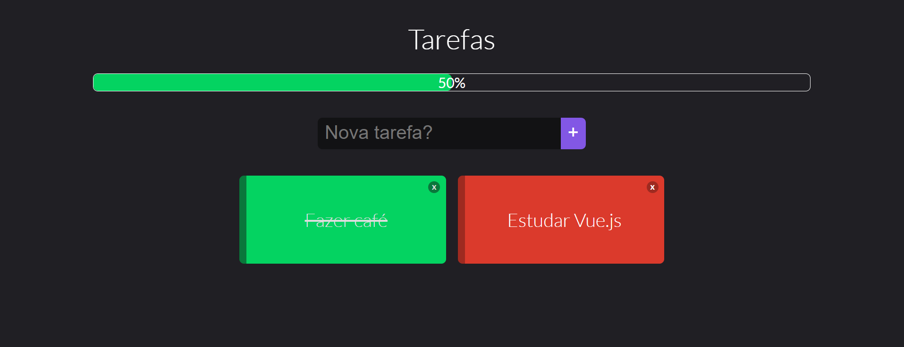

<h1 align="center">
  
</h1>

<h3 align="center">
  Curso Vue JS 2 - O Guia Completo (incl. Vue Router & Vuex)
</h3>

<p align="center">
  Vue.js é um framework Javascript fantástico para construir aplicações Frontend
</p>

<p align="center">Por Leonardo Moura Leitao - Udemy</p>

<p align="center">
  <a href="#como-executar-o-projeto">Como executar o projeto</a>&nbsp;&nbsp;&nbsp;|&nbsp;&nbsp;&nbsp;
  <a href="#anotações">Anotações</a>&nbsp;&nbsp;&nbsp;|&nbsp;&nbsp;&nbsp;
  <a href="#conteúdo-do-curso">Conteúdo do curso</a>
</p>

<p align="center">O Matador de Mostro</p>

<p align="center">
  
</p>

<p align="center">Todo</p>

<p align="center">
  
</p>

## Como executar o projeto

### Requisitos

- [Node.js](https://nodejs.org)

### Clonar este repositório

```bash
git clone https://github.com/eliasmcastro/udemy-curso-vuejs-o-guia-completo.git
```

### Projeto O Matador de Mostro

- Entrar na pasta `01-o-matador-de-mostro`
- Abrir o arquivo `index.html` no seu navegador de preferência para ver o resultado

### Projeto Todo

- Entrar na pasta `02-todo`
- Executar `npm install` para instalar as dependências do projeto
- Executar `npm run serve` para iniciar o servidor de desenvolvimento
- Acessar http://localhost:8080

## Anotações

### Ambiente de desenvolvimento

- [Node.js & NPM](https://nodejs.org)
  - O Node.js deve ser instalado via [package manager](https://nodejs.org/en/download/package-manager) utilizando o Chocolatey no Windows
    - Instalar o [Chocolatey](https://chocolatey.org/install)
    - Executar `cinst nodejs-lts` para instalar o Node.js
    - Executar `node -v` e `npm -v` para verificar se a instalação deu certo
- [Visual Studio Code](https://code.visualstudio.com)
  - Instalar o Visual Studio Code
  - Extensões
    - Tema do Dracula Official
    - Material Icon Theme
    - Vetur
  - Fontes
    - [Fira Code](https://github.com/tonsky/FiraCode)
- [Vue CLI](https://cli.vuejs.org)
  - O Vue CLI é um sistema completo para o desenvolvimento rápido de Vue.js
  - Para realizar a instalação, execute `npm install -g @vue/cli`

### Criando um projeto

- Executar `vue create nomeprojeto` para criar o o projeto
- Executar `npm run serve` para inicializar o servidor em http://localhost:8080

## Conteúdo do curso

- Introdução
- Usando VueJS para Interagir com a DOM
- Usando Condicionais & Renderização de Listas
- Projeto #01 - O Matador de Monstros
- Entendendo a Instância Vue
- Fluxo de Desenvolvimento "Real" Usando Vue CLI
- Introdução aos Componentes
- Comunicação Entre Componentes
- Uso Avançado de Componentes
- Projeto #02 - Tarefas (TODO)
- Manipulando Entrada de Usuário com Formulários
- Usando e Criando Diretivas
- Melhorando sua App com Filtros e Mixins
- Adicionando Animações e Transições
- Conectando com Servidor via HTTP
- Rotas em uma Aplicação VueJS
- Melhor Gerenciamento de Estado com Vuex
- Projeto #03 - The Stock Trader
- Publicando uma Aplicação VueJS na Amazon
- Bonus: Projeto #04 - Projeto Calculadora
- Bonus: Projeto #05 - Problema Monty Hall
- Bonus: Projeto #06 - Base de Conhecimento • Backend
- Bonus: Projeto #06 - Base de Conhecimento • Frontend
- Bonus: CSS Grid & Flexbox
- Bonus: Javascript Essencial
- Bonus: HTML Essencial
